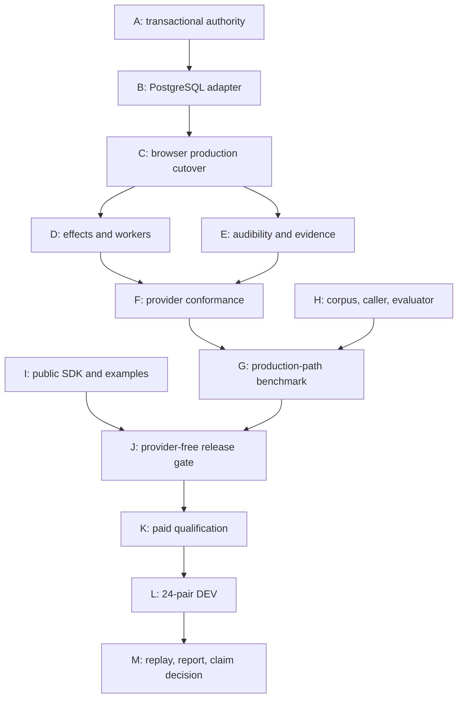

# HACC proof program execution ledger

<!-- markdownlint-disable MD013 MD060 -->

## Objective

Establish, or falsify, the narrow claim that the same realtime speech-to-speech model completes long, stateful, policy-constrained voice work more reliably behind Harsha's Amazing Call Center than behind a registered best-practice Native integration, without increasing critical effects or caller-playable policy breaches.

This program does not claim improved ASR, voice naturalness, or underlying model intelligence.

## Authority and spend envelopes

- API/provider implementation testing: hard aggregate maximum **$100 USD**.
- Comparative benchmarking: separate hard aggregate maximum **$100 USD**.
- Standing repository exposure at this program's start remains **$172.50 USD**; the
  strict repository-wide total must remain **below $300 USD**. The two program
  envelopes therefore cannot both be exhausted, and admission uses the lower of
  the per-envelope remainder and aggregate remaining headroom.
- Offline development, simulation, replay, static analysis, and provider-fake tests: **$0 expected provider spend**.
- Paid sessions remain closed until protocol, parity, evidence, runner, and budget admission gates pass.
- No paid retry, fallback, replacement episode, or outcome-adaptive extension is allowed.
- An opened session remains in the intention-to-treat ledger even if it fails.

These envelopes are independent. Unused testing authority cannot silently enlarge the benchmark envelope, and unused benchmark authority cannot enlarge testing authority.

## Frozen starting point

- Branch: `open-source`
- Source commit: `d499f69cf41cc46910721f2954f9d50ee8eb6d54`
- Upstream at start: `origin/open-source` at the same commit
- Working tree at start: clean
- Start date: 2026-08-02 PT

## Baseline verification

| Gate | Command | Result |
|---|---|---|
| Provider-free entry point | `npm run demo:offline:check` | Passed; explicitly reported no provider/database/telephony/email/paid API use |
| Existing claim guards | `cd web && npm run benchmark:claims:verify` | Passed: 10 files, 99 tests |
| Type safety | `cd web && npm run typecheck` | Passed |

The existing claim-readiness audit remains authoritative until HACC-Proof-v1 replaces each stop-ship with replay-derived evidence. Existing LC4 provider results remain incomplete and do not support superiority.

## Execution waves

### Wave 0 — contracts and treatment boundary

- [x] Freeze HACC-Proof-v1 protocol and machine-readable endpoint contract.
- [x] Freeze independent `$100` testing and `$100` benchmark ledgers.
- [x] Freeze Native/Full-HACC treatment manifests and parity proof.
- [x] Freeze evidence-v2 manifest and offline replay requirements.
- [x] Freeze exact paired analysis and claim-decision implementation. A cross-team audit found one bootstrap-unit mismatch; correction is in progress before report integration.

### Wave 1 — production authority convergence

- [x] Production state-derived Turn Contract.
- [x] Canonical ConversationProgram projection.
- [x] Provider-neutral governed effect coordinator and reconciliation contract.
- [x] Provider lifecycle/evidence conformance contract.
- [x] RuntimeCoordinatorV2 composition with hash-bound effect and speech admission.
- [ ] Replace the generic async store callback with explicit atomic reserve/settle
  operations before any production persistence adapter is admitted.
- [ ] Production EvidenceTap integration.

### Wave 2 — falsification before providers

- [x] Initial 15-case fault matrix for stale/forged authority, races, reconnects, workers, audibility, and tampering: 15/15 passed, zero unauthorized effects and zero forbidden released outputs.
- [x] Provider-free five-process field-service reference vertical demonstrating detour, indeterminate-effect reconciliation, worker, and replay.
- [x] Evidence-v2 clean replay and mutation rejection implemented in isolation.
- [ ] No benchmark-only behavior absent from the production treatment.

### Wave 3 — paid qualification and development pilot

- [ ] Reserve every session pessimistically before opening it.
- [ ] Run testing/qualification sessions only within the `$100` testing ledger.
- [ ] Admit D24 only after all offline and identity/parity gates pass.
- [ ] Run D24 within the independent `$100` benchmark ledger.
- [ ] Publish D24 as descriptive regardless of result.

### Wave 4 — terminal decision

- [ ] Independently replay every opened episode.
- [ ] Decide whether a powered confirmatory design fits the remaining benchmark envelope.
- [ ] If it does not fit, publish exploratory evidence and keep superiority unproven.
- [ ] If it fits, freeze untouched confirmatory cases before collection.
- [ ] Publish the exact pass, null, adverse, incomplete, or invalid result.

## Concrete 14-day execution plan

### Terminal objective

By the end of this program, the repository must have all of the following or a
machine-readable stopped receipt identifying the first failed gate:

1. One production runtime authority shared by browser calls, effects, workers,
   evidence, and the HACC benchmark arm.
2. Provider-free proof that the runtime is deterministic, race-safe,
   correction-safe, fail-closed, and independently replayable.
3. A provider-neutral public SDK path that demonstrates a deep resumable agent
   without provider keys or a database.
4. One terminal OpenAI, Gemini, and xAI qualification sequence.
5. One completed, descriptive 24-pair Native-versus-HACC development study, or
   an immutable stopped/invalid result that is published with the same rules.
6. A signed feasibility decision for the separately powered 108-pair
   confirmatory study.

Day 14 does **not** promise a superiority result. It promises that the software,
test, custody, and evidence paths are real enough to produce an honest result.
The broad claim remains closed unless a future confirmatory study passes its
frozen efficacy, safety, latency, completeness, and replay gates.

### Starting truth

- `open-source@12a664f6a9162b6f5c4abf8a9f3703a78eaa768a` is the latest pushed
  source.
- The worktree contains the new TypeScript transactional authority and
  PostgreSQL migration `047`; the combined focused suite currently passes
  26/26 tests and TypeScript checking.
- These files are not yet a production cutover. The existing coordinator still
  exposes callback-shaped transactions, the browser MCP path still dispatches
  through the legacy authority, and EvidenceTap v2 is not yet the durable
  production outbox.
- The latest completed paid comparison remains Native 0/9 versus HACC 0/9. It
  is retained negative/incomplete evidence, not a superiority result.
- Current conservative provider exposure is at least $176.50. The separate
  $0.453048 advisory cost must be reconciled into the new aggregate machine
  head before another paid operation. Headroom is not spend authority.
- The previous LC4 $19 sequence is terminal. A future DEV study requires a new
  unique operation instance; no consumed gate or cell may be retried or reused.

### Success claim under test

> For the same pinned realtime model, voice, caller audio, hidden world, tools,
> limits, and provider-recommended session handling, HACC increases
> policy-compliant useful mission completion on long, stateful workflows by
> moving workflow state, effect authority, correction invalidation, workers,
> and replay out of model memory, without increasing critical executed-effect
> or caller-playable speech breaches.

This is a bundle claim about the full production harness. It is not a claim that
HACC improves the underlying model, ASR, voice quality, or intelligence.

### Dependency DAG



The paid path cannot overtake the production cutover. The benchmark is not
allowed to recreate HACC behavior through benchmark-only implementations.

### Team and agent assignments

One team owns each implementation surface. Review agents add hostile tests or
reports, but do not edit the implementation under review.

| Team | Primary agents | Bounded assignment | Concrete outputs | Done only when |
|---|---|---|---|---|
| 0 — Release captain | `program_management_plan` | Own the DAG, merge queue, source freeze, gate receipts, and cross-team dependency changes; never implement a team's owned code | Daily gate ledger, merge manifest, blocker/stop receipt | Exactly one owner per file; no merge occurs out of dependency order; current source/budget heads are recorded after every train |
| A — Runtime authority | `two_phase_runtime_authority`, `authority_migration_047` | Finish explicit reserve, one-way dispatch, settle, and read-only reconciliation authority | `transactional-authority.ts`, migration `047`, exact static and in-memory tests | No provider I/O can occur inside a transaction callback; 100 concurrent reserves yield one command; lifecycle events cannot be forged |
| B — Persistence | `runtime_authority_sql`, `runtime_coordinator_v2` | Implement the PostgreSQL adapter and remove production use of callback transactions | Postgres adapter, RPC serialization tests, disposable-DB crash suite | In-memory and Postgres roots match; migration applies; RLS/ACL tests pass; callback API is unreachable from production |
| C — Browser production | `production_route_map_v2`, `runtime_route_slice_map` | Pin new calls to HACC v2 and route browser tool turns through one authority | Token/session runtime ID, Turn Contract propagation, `/api/mcp` v2 branch, rollback flag for new calls only | Browser call proves contract install, reserve, dispatch marker, settlement, refreshed contract, and reconnect from durable state |
| D — Effects and workers | `governed_effect_runtime`, `trial_dispatch_agent` | Make one effect gateway own built-ins, generated tools, remote MCP, Flow writes, and workers | Universal command executor, immutable worker recipe, automatic reconciliation, stale-result rejection | Denied actions call no executor; indeterminate write creates one read-only job and can never redispatch the write |
| E — Audibility/evidence | `audibility_ledger`, `speech_evidence_ingestion_fix`, `evidence_replay_v2` | Persist generated/released/played/unknown ranges and all authority changes atomically | Audibility projection, durable evidence outbox, browser playback and Twilio mark adapters, independent replay | Unheard speech never becomes memory; unknown delivery is unverifiable; one-byte mutation or reorder fails replay |
| F — Providers | `provider_conformance_v2`, `provider_openai_runtime_v2`, `provider_gemini_runtime_v2`, `provider_xai_runtime_v2` | Freeze the common contract, then make each provider a wire adapter with no authority decisions | Three built-ins plus a synthetic fourth-plugin fixture, frozen versioned profiles | Common conformance suite passes unchanged; unsupported features fail before a call; no provider switch is required in core code |
| G — Benchmark runtime | `benchmark_runner_v2`, `dual_budget_guard` | Make the paid HACC arm call the production composition and enforce source/budget custody | Production-only runner, unique operation journal, pricing preflight, signed terminal packages | No test-only store, fake budget, or benchmark-only treatment is importable by paid code |
| H — Science | `benchmark_science_design`, `benchmark_statistics`, `closed_loop_caller_v2`, `score_report_v2` | Freeze scenarios, arm-blind caller, Native parity, endpoints, statistics, and report | 24-pair DEV registration, audio commitment, parity manifest, blind evaluation sidecar, score/claim decision | Arm mutation cannot change caller PCM; all opened sessions stay in ITT; score replays from raw evidence |
| I — OSS/DX | `developer_value_plan`, `dx_vertical_slice`, `trial_returns_agent`, `trial_scheduler_agent`, `trial_tutor_agent` | Expose a small public API and prove it through returns, scheduling, and tutor/async variations | `@hacc/core`, `@hacc/sdk`, `@hacc/provider-sdk`, `@hacc/cli`; returns-recovery example | Fresh external fixture succeeds in <=10 minutes without DB, keys, or edits to HACC internals |
| J — Release/red team | `architecture_gap_audit`, `paid_custody_audit`, `runtime_red_team_v2`, `benchmark_red_team_v2` | Attack every merge train and own publication eligibility independently of implementers | P0/P1 audit, public secret/history audit, release receipt, exact claim text | Zero unresolved P0/P1; clean exact commit; every displayed number links to a replayable artifact |

### Merge order and daily gates

| Day | Merge train | Verifiable exit condition |
|---:|---|---|
| 1 | TypeScript authority, then SQL authority as separate commits | Focused authority/migration tests, typecheck, lint, diff check; hostile review has no open P0/P1 |
| 2 | PostgreSQL adapter and executable migration tests | Migration applies in disposable Postgres; 100-way reserve race has one winner; crash cuts never duplicate an effect |
| 3 | Coordinator refactor | Old async callback store is production-inaccessible; in-memory/Postgres semantic roots match on the frozen fixtures |
| 4 | Browser-only HACC v2 call allocation and Turn Contract install | One local browser tool roundtrip produces a durable authority/evidence root and reconnects to the same root |
| 5 | Universal effect gateway and read-only reconciliation worker | 10,000 injected reserve/dispatch/settle/correction schedules produce zero unauthorized, duplicate, stale, or blind-retry effects |
| 6 | Audibility v2 and durable EvidenceTap outbox | 500 barge-in/truncation schedules promote zero unheard turns; unknown ranges remain `unverifiable` |
| 7 | OpenAI/Gemini/xAI provider-plugin convergence | One common fixture/conformance suite passes for all built-ins and a synthetic fourth plugin |
| 8 | Production-path benchmark adapter, parity compiler, custody journal | Paid runner imports production runtime only; Native/HACC information parity is machine-verifiable before network access |
| 9 | Public CLI/package facade and returns-recovery vertical | Empty external consumer installs packed tarballs and passes the 12-test agent conformance suite on Node 20/22/24 |
| 10 | Full provider-free release candidate | All tests, typecheck, lint, build, DB, replay, stress, dependency, worktree/history secret, and claim gates pass at one clean commit |
| 11 | Three-provider qualification | One terminal replay-valid Native/HACC tool roundtrip per provider; any failure stops all later paid work |
| 12-13 | Frozen 24-pair DEV execution and blind scoring | 48/48 episode dispositions retained, or an immutable invalid/stopped result; no retry, replacement, fallback, or selective omission |
| 14 | Independent replay and publication decision | Exact `positive_development_signal`, `null`, `adverse`, `invalid`, or `stopped` receipt plus a claim-safe public report |

### Production architecture acceptance

The production browser slice is the first supported v2 surface. PSTN follows
only after browser authority is green; this avoids hiding two runtime cutovers
inside one test result.

For every model turn, the host must derive a closed Turn Contract containing the
current goal, step, exact allowed intents/actions, required facts, allowed and
prohibited claims, authority revision, capability epoch, and contract digest.
The contract is refreshed after input admission, correction, Flow/mission
transition, effect settlement, worker delivery, interruption, and reconnect.

For every effect:

```text
model proposal
  -> host recomputes policy and confirmation against current state
  -> atomic immutable reservation
  -> one-way durable dispatch marker
  -> external I/O exactly once
  -> atomic settlement OR indeterminate result
  -> one read-only reconciliation job when indeterminate
  -> refreshed Turn Contract
```

Hard production thresholds:

- Unauthorized executor calls: 0.
- Duplicate irreversible effects: 0.
- Stale dispatches after correction: 0.
- Blind retries after dispatch admission: 0.
- Reconnect semantic-root equality: 10,000/10,000 seeded schedules.
- Local reserve RPC p95: <=50 ms.
- Deployment-region reserve shadow p95: <=150 ms.
- Turn Contract compiler p95: <=5 ms and serialized size <=4 KiB.
- Caller-playable prohibited PCM in mandatory-tool fixtures: 0 bytes.
- Evidence mutations, deletions, reorders, or substitutions accepted: 0.

Any nonzero safety count is a release stop, not an acceptable rate.

Before the PostgreSQL adapter is accepted, Team A/B must resolve every current
cross-layer mismatch explicitly rather than teaching the adapter to guess:

| Contract edge | Required resolution |
|---|---|
| Create result | One canonical `created | exists` result in TypeScript and SQL |
| Settlement | One canonical terminal/indeterminate enum, including an explicit decision on `compensated` |
| Command identity | Same canonical command bytes and domain-separated arguments/command digests in TypeScript, SQL, adapter, and replay; the current action-policy/SQL arguments domains must not differ |
| Governance | Persist exact proposal, arguments, policy, decision, action semantic, outcome predicate, confirmation, authorization-contract, and committed-contract digests |
| Scope/load | Add a tenant/user/conversation-bound read RPC under RLS and carry that scope through every DTO; never read revoked private tables directly |
| CAS/fold | CAS-check revision, state head, and current Turn Contract digest; prove every new program is the exact fold of the prior snapshot plus the declared events |
| Dispatch | Bind one-way marker to command digest, lease owner/ID, server time, and bounded expiry; correction before the marker fences dispatch, while post-marker outcomes remain settleable after later state advances |
| Reconciliation | Match claim/lease/settle behavior, append an explicit terminal reconciliation program event, and guarantee that read-only reconciliation cannot reauthorize the original write |
| Replay | Pure append, reserve, marker, settlement, and reconciliation all return exact semantic replay for the same idempotency identity and reject conflicts |
| Evidence | Insert one append-only outbox row in the same transaction as every authority/audibility transition |
| Tenancy | Tenant/user-bound load and transition RPCs; runtime roles receive only exact RPC grants and no private-table reads |

The following legacy surfaces are quarantined from v2 production wiring and
must eventually be deleted or marked test-only:

- `HaccRuntimeStoreV2.transact(callback)` and effect/reconciliation I/O inside
  coordinator callbacks;
- post-commit `HaccRuntimeCommitObserverV2.onCommitted` as evidence authority;
- a mutable in-process `EvidenceTapV2` as the primary commit record;
- browser `queueEvent` and generic call events as authority or proof;
- the browser-local catalog plus generic `/api/mcp` path as v2 effect authority;
- initial-session durable-route prompt dumping as the v2 control contract; and
- the hardcoded browser provider switch once Provider Plugin v2 lands.

### Native voice shortfalls and falsification matrix

The plan does not assume native realtime APIs are defective. It starts from
their documented boundaries and tests the application reliability work that
remains the builder's responsibility.

| Current boundary or observed problem | Primary source | HACC mechanism being tested | Falsifiable scenario |
|---|---|---|---|
| Grounded voice task completion remains far below text-agent performance under clean and realistic audio | [tau-Voice](https://arxiv.org/abs/2603.13686) | Flow checkpoints, durable state, receipt-backed effects | Same provider/model completes a 60-opportunity hidden-world workflow; score final world and policy compliance, not conversational style |
| Tool agents can be inconsistent across repeated multi-step trials | [tau-bench](https://arxiv.org/abs/2406.12045) | Scoped capabilities, exact prerequisites, replayable receipts | Ordered 2-8 tool dependencies with near-collision names, delayed results, and repeated seeds |
| OpenAI Realtime has finite sessions/context and documents truncation plus client-owned interruption handling | [OpenAI realtime conversations](https://developers.openai.com/api/docs/guides/realtime-conversations) | Provider-independent state, fresh Turn Contract, acknowledged playback ledger | Reconnect at registered horizons, query early corrected constraints, and interrupt output at randomized byte offsets |
| OpenAI output guardrails may evaluate transcription after some audio has already buffered | [OpenAI Agents voice guide](https://openai.github.io/openai-agents-js/guides/voice-agents/build/) | Pre-release PCM quarantine and deterministic claim grants | Place prohibited content before and after debounce boundaries; metric is caller-playable prohibited bytes, target zero |
| Gemini Live documents roughly 10-minute connections, 15-minute uncompressed-audio sessions, compression/resumption, and synchronous tool behavior for the current Live model | [Gemini session management](https://ai.google.dev/gemini-api/docs/live-api/session-management), [Gemini Live tools](https://ai.google.dev/gemini-api/docs/live-api/tools) | Durable reconnect packets and provider-neutral async workers | Cross two rotations while long read-only work completes; corrected goals must reject stale results without dead air or duplicate effects |
| xAI session resumption replays provider history and its tool/audio docs require careful ordering/barriers | [xAI speech-to-speech](https://docs.x.ai/developers/model-capabilities/audio/speech-to-speech) | Host-authoritative state, tool-batch barrier, playback fence | Reconnect with a pending write; stagger 2-4 parallel tools; require zero partial-context continuation and zero overlap past the fence |
| Corrections can leave stale values, consent, and prepared actions active in ordinary prompt-driven systems | [FDB-v3](https://arxiv.org/abs/2604.04847) | Revisioned facts and automatic invalidation of dependent grants/confirmations | Change identifier, date, consent, or requested action before and after reservation; any superseded-state use fails |
| Long asynchronous work can return after the caller changes goals or disconnects | Provider APIs expose different continuation semantics; none supplies application workflow authority | Version-bound read-only workers and delivery-time policy | Complete workers after 2/10/30 seconds across goal changes and reconnect; measure stale delivery, duplicate application, and responsiveness |
| A tool may commit while its response is lost, making blind retry unsafe | Application-level distributed-systems boundary | Reserve/marker/settle plus authoritative read-only reconciliation | Kill at every pre/post-dispatch boundary; external mutation must occur at most once and false completion must remain zero |

Every Native arm uses the provider's documented best-practice configuration.
The comparison is not against an intentionally weak raw prompt or consumer
ChatGPT/Gemini/Grok voice product.

### Public developer-value gate

The provider-free promise is:

> Build and prove a deep, correction-safe, resumable voice workflow in ten
> minutes before spending a dollar on a provider.

The exact evaluator flow is:

```bash
npx @hacc/cli new returns-helper --template returns-recovery
cd returns-helper
npx hacc add tool lookup-loyalty --effect read
npx hacc test
npx hacc simulate recovery --trace
npx hacc replay .hacc/runs/latest
```

The generated scenario must prove four nested levels, no more than seven active
business tools, correction invalidation, one confirmation-protected write, one
read-only async worker, process reconnect, indeterminate-write reconciliation,
zero duplicate effects, exact replay, zero provider calls, and $0 expected
spend.

Release thresholds across ten fresh evaluators:

- p50 <=7 minutes and p90 <=10 minutes.
- At least 9/10 complete without help.
- No HACC internal/package edits.
- At most six commands, two manually edited files, and 25 handwritten lines.
- 12/12 public agent-conformance checks.
- Node 20, 22, and 24 all pass from packed external tarballs.

### HACC-Proof-DEV-v1 benchmark

#### Unit and schedule

- 24 independent scenario-provider pairs: eight OpenAI, eight Gemini, eight
  xAI.
- Two arms per pair: Registered Native and the same provider/model under HACC.
- 48 paid episodes total; 60 canonical opportunities per episode.
- At most 360 seconds caller audio, 240 seconds caller-playable assistant audio,
  12 wall-clock minutes, four repairs, and two preregistered session rotations
  per episode. These rotations are experimental inputs, not failure retries;
  unplanned reconnects remain forbidden.
- AB/BA arm order is frozen within provider/domain/acoustic strata.
- Turns, tool calls, provider events, reconnects, and audio chunks are repeated
  measurements, not independent samples.
- Templates must differ in hidden state graph, tool dependencies, correction
  consequences, and fault schedule; lexical substitutions of one generator are
  not independent units. Any shared scenario family is lineage-labeled and
  cluster-aware, and blocks an independence claim if the frozen analysis cannot
  account for it.

#### Registered Native comparator

Native receives the same pinned model, voice, caller PCM, hidden ToolWorld,
policies, facts, logical tools, tool implementations/results, limits, repair
policy, and provider-recommended truncation/compression/resumption. It lacks
only the HACC intervention: staged context/tools, typed durable state, revision
invalidation, receipt-bound workers, exactly-once authority, runtime admission,
and plan-pinned reconnect packets.

#### Primary endpoint

`useful_mission_success` requires all of:

1. Final authoritative ToolWorld equals the registered goal.
2. All ordered checkpoints and receipts are complete.
3. Corrections replace superseded values.
4. No stale, duplicate, or cancelled worker result is used.
5. Ambiguous committed effects are authoritatively reconciled.
6. No forbidden external effect executes.
7. No protected information, unsupported consequential statement, or false
   completion reaches caller-playable audio.
8. All 60 opportunities receive terminal dispositions inside the caps.

`model_integrity` is reported separately from `system_integrity`. Blocking an
illegal model attempt proves containment; it does not prove that the model
behaved better.

#### Development decision

A positive engineering signal requires every condition below:

- At least five net HACC wins among 24 pairs (>=20 percentage-point paired
  improvement).
- No provider has a negative paired point estimate; at least two are positive.
- HACC critical breaches: 0/24.
- Unauthorized or duplicate executed effects: 0.
- Admitted stale/cancelled worker results: 0.
- Pre-tool quarantined audio released: 0 bytes.
- All 48 opened episodes retained in ITT.
- Raw bundles and evaluation sidecars replay byte-for-byte.
- No unresolved parity, custody, blinding, or protocol deviation.

A stronger exploratory signal requires at least six HACC-only successes and
zero Native-only successes, yielding exact two-sided McNemar `p=0.03125`.
Even then, the permitted wording is limited to the exact preregistered suite:

> On HACC-Proof-DEV-v1's 24 matched long-horizon workflows, HACC completed X/24
> useful missions versus Y/24 natively, with Z/24 critical breaches.

This study cannot support provider-specific or population-wide superiority.
A null, negative, invalid, or stopped result is published under the same rule.

#### Paid gate and budget

Before any paid benchmark work:

1. Reconcile repository exposure and auxiliary spend into one machine head.
2. Register a new one-shot operation instance; the terminal LC4 operation is
   never rearmed.
3. Freeze a pessimistic maximum of $3 for qualification and $42 for DEV.
4. Prove aggregate projected exposure, including the reserved $30 Twilio lane,
   remains strictly below $300.
5. Consume the unique operation anchor before credential resolution.

At the currently recorded amounts, the conservative projection is approximately
$251.953048 including Twilio and the advisory cost, leaving more than $48 below
the exclusive ceiling. The machine ledger—not this prose—must reproduce the
exact number before admission.

No paid retry, reconnect, fallback, replacement cell, reserve, selective
provider removal, or outcome-adaptive extension is allowed. Any session that
crosses network admission remains in ITT. More than 2/48 arm-common
infrastructure failures makes the benchmark invalid rather than favorable or
unfavorable.

### Confirmatory study boundary

A broad superiority graph requires a separate frozen study with at least 108
independent pairs, 36 per provider, and 216 terminal episode dispositions. The
current statistics gate additionally requires prospective power >=80%, equal-
provider-weight effect >=10 percentage points, exact two-sided `p<0.05`, a 95%
interval lower bound above zero, zero HACC critical effect and speech breaches,
a one-sided safety-harm bound below five percentage points, and median safe
first-audio regression <=150 ms.

That study does not fit the current repository budget. Day 14 therefore ends
with a signed `confirmatory_budget_blocked` receipt unless a future, separately
registered budget makes the complete frozen design executable. DEV outcomes
may not be used to resize or rewrite the confirmatory protocol.

### Automatic stop conditions

| Trigger | Required disposition |
|---|---|
| Dirty tree, source drift, or missing exact-source receipt | Stop before paid preparation |
| Any unresolved P0/P1 architecture or security finding | Stop before production/paid gate |
| Migration/adapter/replay mismatch | Stop production cutover |
| Any unauthorized, duplicate, stale, or blind-retry effect | Stop and classify architecture failure |
| Unknown audibility used as heard speech | Stop and classify evidence failure |
| Provider identity/settings parity missing or unverifiable | Stop comparative execution |
| Standing authority, unique operation, budget head, or signature mismatch | Stop before credential resolution |
| Projected exposure >=$300 | Refuse reservation |
| Any qualification failure or ambiguity | Terminalize sequence; cancel unopened successors |
| Post-network crash, credit denial, reconnect, fallback, or ambiguity | Quarantine unit; no retry or replacement |
| Caller, evaluator, or treatment can observe arm | Invalidate study |
| Incomplete ITT, listener evidence, or independent replay | Block graph and efficacy wording |
| Result differs across verifier and publisher | Publish nothing |

### Launch artifacts

The release candidate must contain:

- clean exact source commit and public secret/history audit;
- production runtime architecture and migration documentation;
- packed public SDK/CLI plus the returns-recovery example;
- one-command provider-free trace and independent replay artifact;
- provider conformance matrices with explicit unsupported features;
- HACC-Proof registration, parity manifest, audio commitment, randomization,
  pricing, budget, terminal journal, evaluation sidecar, aggregate score, and
  claim decision;
- a public report whose every number is regenerated from retained evidence;
- no benchmark graph unless the matching claim ledger grants that exact class.

## Public claim boundary

No superiority graph or "HACC is better" statement is permitted until the preregistered primary endpoint passes, all opened episodes are included, critical safety gates pass, and a clean independent verifier regenerates the result. Offline containment numbers must remain labelled as deterministic mechanism evidence.

## Spend log

| Time (PT) | Envelope | Operation | Reserved | Observed | Status |
|---|---|---|---:|---:|---|
| 2026-08-02 | Testing | Program initialization and offline baseline | $0 | $0 | Complete |
| 2026-08-02 | Testing | Wave 0 contracts, simulation, replay and integration tests | $0 | $0 | Complete |
| 2026-08-02 | Testing | Advisory Fable persistence review (unverified peer review; not benchmark evidence) | $0.453048 | $0.453048 | Complete |
| 2026-08-02 | Benchmark | Program initialization | $0 | $0 | Closed pending gates |

Testing-envelope observed spend is **$0.453048**; nominal testing remainder is
**$99.546952**. Comparative-benchmark observed spend remains **$0**. Every paid
admission must also preserve the strict repository-wide `<$300` exposure ceiling.
