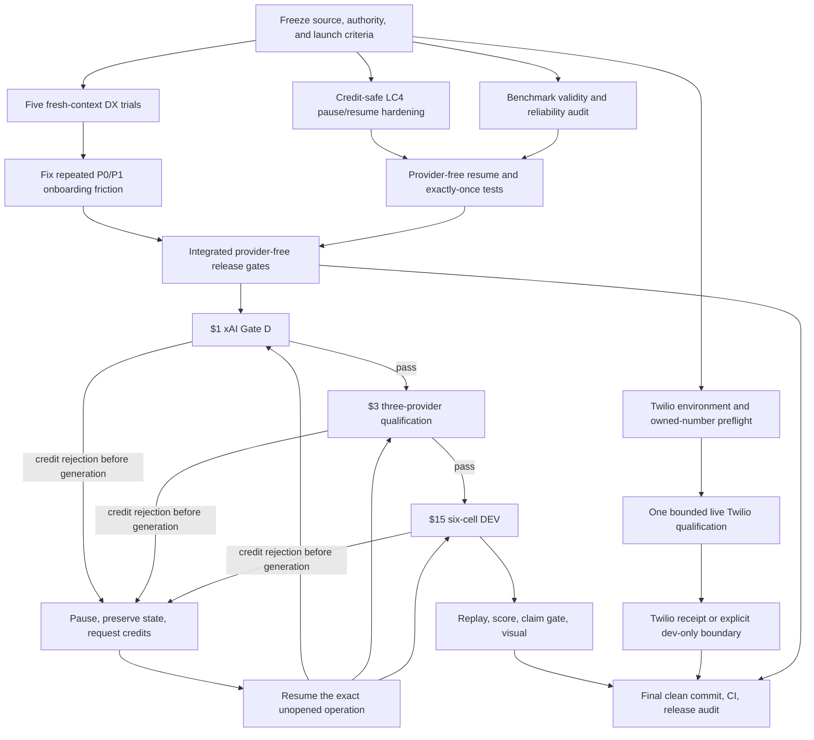

# HACC bounded open-source launch sprint

Status: developer-preview release reconciliation
Frozen starting source: `5def6f6398e1a99160674eff0a81a13846b0f87e`  
Branch: `open-source`  
Sprint date: 2026-08-01  
Time box: 1-2 focused hours of parallel execution, followed only by already-started verification or paid calls  

## 2026-08-02 terminal outcome

- The provider-free developer and mechanism gates remain the release basis.
- xAI Gate D passed from exact source `84e3cf9`; the serial qualification then
  passed OpenAI and failed closed on Gemini `speech_before_tool`. The unopened
  xAI qualification shard and all six DEV cells were cancelled.
- The sequence is terminal: there is no three-provider score, comparative
  efficacy result, or benchmark graph to publish.
- Twilio restricted-key setup is complete. Live telephony remains blocked only
  on an explicitly approved E.164 destination and a named bridge-hosting GCP
  project; no destination will be inferred and no unrelated cloud project will
  be mutated.
- Release wording must say **developer preview** and distinguish deterministic
  framework evidence from realtime-model efficacy.

## Launch decision this plan must produce

At the end of this sprint, Harsha's Amazing Call Center is launch-ready only if:

1. a new developer can reach a useful offline flow simulation through a documented, reproducible path;
2. the realtime provider, flow, tool, durable-state, and worker surfaces are described without hiding production limitations;
3. the full source tree, release checks, public secret audits, and dependency checks pass at one exact pushed commit;
4. any benchmark claim is derived only from a complete, source-bound, replay-verified artifact;
5. provider-credit rejection can pause a paid benchmark before generation and resume without duplicating completed paid work;
6. the Twilio bridge either has a retained live qualification receipt or remains explicitly classified as development-only; and
7. the public README and launch copy distinguish proven developer/mechanism value from unproven model-efficacy claims.

This sprint does **not** require HACC to outperform every Native arm. A tied efficacy result is publishable if it is complete and honest; the developer-experience and enforcement value must stand independently.

## Fixed authority and spend boundaries

| Ledger | Existing conservative settlement | New authority | Hard ceiling | Rule |
|---|---:|---:|---:|---|
| LC4/provider evidence | $242.50 | $19.00 | $300.00 cumulative | $1 xAI Gate D, then $3 qualification, then $15 six-cell DEV |
| Twilio live qualification | $0.00 in this sprint | $30.00 | $30.00 sprint-local | No calls to an unapproved third-party number |

The two ledgers are not interchangeable. Provider calls stop before the cumulative LC4 ledger reaches $300. Twilio calls stop before the sprint-local Twilio ledger reaches $30.

No API secret may be printed, committed, copied into an artifact, or sent to a subagent. Existing credentials may be read only through the repository's established environment handoff.

## Execution graph

Any non-credit provider failure after generation begins terminalizes that paid unit and blocks an efficacy claim. It is not silently retried.

## Workstreams and agent assignments

### DX-1 through DX-5: independent fresh-context user trials

Each trial receives only the public repository URL/path, a concrete product goal, a prohibition on provider spend, and a fresh isolated checkout. Each must record commands, wall-clock milestones, confusion, errors, workarounds, and a 1-5 score for setup, mental model, flow authoring, testing, and confidence.

| Agent | Independent build goal | Primary surface under test | Success condition |
|---|---|---|---|
| DX-1 | Membership and returns support agent | Quickstart, example import, Flow v2 | Runs an offline membership/return scenario and explains the current step/tool set |
| DX-2 | Field-service scheduling agent | Async `launch_task`, durable state, recovery | Demonstrates a worker-backed detour and resumes the parent goal offline |
| DX-3 | Education/tutoring agent | Multi-goal mission and provider swap | Builds or adapts a multi-goal flow and identifies provider-specific configuration |
| DX-4 | Regulated intake agent | Guardrails, receipts, extension manifest | Adds one safe custom tool and proves a forbidden/unapproved action fails closed |
| DX-5 | Personal assistant with a long conversation | Visualization, checkpoints, reconnect | Simulates a long flow, inspects state, and recovers from a checkpoint |

Trials are observational and isolated. They must not edit the shared branch or use paid APIs. Their reports land outside the checkout, then the primary agent synthesizes only repeated or launch-blocking findings.

### BENCH-R: resumability and exactly-once architecture

One implementation lane owns benchmark pause/resume. A separate reviewer challenges its validity.

Required behavior:

- journal an immutable operation intent before every paid boundary;
- classify a provider credit/quota rejection as resumable only when retained evidence proves generation never started and no playable output or tool effect occurred;
- atomically pause the budget ledger and preserve all completed cells, sessions, opportunities, and receipts;
- resume only the exact unopened or generation-zero operation, with the same source, corpus, schedule, model, voice, arm, and authorization bindings;
- reject duplicate completion, stale resume heads, changed credentials/models/source, ambiguous provider outcomes, and any attempt to rescore a partial cell;
- allow the remaining cells to continue without rerunning already completed cells;
- keep transport/model failures after generation non-resumable and claim-ineligible.

Provider-free acceptance tests:

1. OpenAI/Gemini/xAI-shaped pre-generation credit errors pause with zero new completed generations.
2. Resume continues at the exact pending opportunity and never reopens a completed opportunity.
3. Crash after intent but before network call resumes safely.
4. Crash after provider generation but before local finalization is quarantined as ambiguous and cannot resume automatically.
5. Stale head, changed source, changed model, changed corpus, or changed authorization fails closed.
6. Two concurrent resume attempts admit exactly one owner.
7. Completed cells survive process restart and are not rerun.
8. Aggregate scoring remains unavailable until all six cells and authority evidence are present.

### BENCH-V: benchmark validity and numerical proof

The reviewer verifies that the six cells compare matched Native and HACC conditions for OpenAI, Gemini, and xAI with identical model, voice, caller audio, schedule, opportunity set, history compiler, and transport limits. HACC may differ only by preregistered harness treatment.

Primary endpoints are frozen before the run:

- strict long-call alignment;
- mission completion;
- ordered checkpoint completion;
- critical-fact retention and correction use;
- forbidden-action/guardrail violations;
- unresolved obligations at terminalization;
- transport attrition and completed opportunity count.

No superiority language or graph is emitted unless the six-cell artifact is complete, replay-valid, and the preregistered comparison supports it. Otherwise publication says “tied,” “inconclusive,” or “mechanism evidence only.”

### TWILIO-Q: bounded live transport qualification

Preflight is read-only: verify credential presence without revealing values, inspect account status/balance, inventory owned numbers, and identify a repository-configured approved test destination. If no owned/approved destination exists, stop and report that single human blocker rather than calling an arbitrary number.

If preflight passes, run the smallest live qualification that proves:

- Twilio request authentication;
- one outbound or inbound PSTN connection using owned/approved numbers;
- bidirectional media reaches the standalone bridge;
- one provider audio response and one scoped tool roundtrip traverse the bridge;
- hangup and cleanup terminalize with bounded queues and a retained receipt;
- actual Twilio spend stays below $30.

This does not establish load, multi-instance durability, or acceptable crash loss. Those claims remain withheld.

## Developer-experience fix policy

Only findings meeting at least one condition enter this sprint:

- blocks 2 or more fresh users;
- prevents every user from reaching the offline demo;
- causes a user to expose a secret or accidentally authorize spend;
- makes the core Flow/tool/worker mental model materially incorrect;
- prevents inspection of current state, next actions, or failure cause;
- is a documentation/runtime contradiction on the default path.

Fix priority:

1. one-command health/doctor and offline demo path;
2. precise setup errors with the corrective command;
3. visualization of current flow node, scoped tools, durable facts/obligations, workers, and receipts;
4. copy-pasteable examples for extensions and deep flows;
5. removal of stale or overbroad launch claims.

Cosmetic redesign, new providers, production-scale telephony, generalized write-capable workers, and unrelated architecture expansion are out of scope.

## Paid execution protocol

Paid execution begins only after the shared tree is clean and all provider-free gates pass.

1. Freeze the exact source commit and evidence roots.
2. Run xAI Gate D once, maximum $1.
3. If it passes, run three-provider qualification once, maximum $3.
4. If it passes, run six-cell DEV, maximum $15.
5. On proven pre-generation credit rejection, pause and notify Harsha with provider, stage, required top-up, ledger head, and exact resume command.
6. On any other failure, terminalize honestly; do not retry under this authorization.
7. On completion, independently replay authority, transport, audio, ASR, scoring, allocation, and budget evidence before generating public results.

## Release gates

All must pass on the final exact commit:

- focused tests for every modified component;
- complete web test suite;
- TypeScript, ESLint, production build;
- Node 20.19, 22.13, and 24 compatibility through GitHub Actions;
- PostgreSQL/pgvector/RLS/migration/replay job;
- public worktree and full-history secret audits;
- locked dependency audit;
- offline claims verifier;
- clean fresh-clone quickstart/doctor/offline-demo smoke test;
- README, provider matrix, benchmark boundary, budget, and progress reconciliation;
- no uncommitted files and `HEAD == origin/open-source` after push.

## Commit boundaries

Commits remain small and independently revertible:

1. sprint plan only;
2. benchmark pause/resume contract and tests;
3. bounded DX/onboarding improvements;
4. Twilio qualification code/docs, if required;
5. paid evidence/public result update;
6. final release reconciliation.

## Stop conditions

Stop paid work immediately when:

- either ledger would exceed its ceiling;
- a credential is missing or rejected;
- a provider outcome is ambiguous after generation starts;
- source, model, schedule, corpus, or authorization differs from the frozen plan;
- a release verifier fails;
- the benchmark cannot preserve Native/HACC parity.

Provider-free work may continue while waiting for credits, but the sprint may not invent a score, replace a failed cell, widen the benchmark, add a provider, or extend into general platform redesign.
