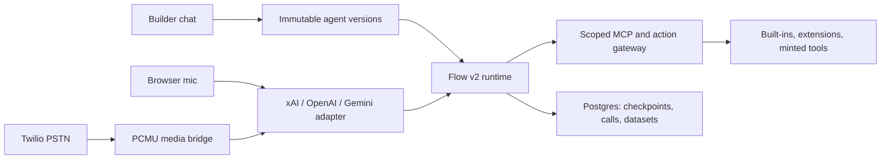

# Harsha's Amazing Call Center

An open, provider-neutral starting point for building speech-to-speech agents that can reliably finish long, tool-driven workflows.

Harsha's Amazing Call Center combines a visual builder, a high-authority builder agent, realtime browser and phone calls, durable call records, extensible tools, datasets, knowledge retrieval, and a deterministic Flow v2 runtime. It is designed for support, sales, intake, scheduling, education, field operations, personal assistants, and any other realtime voice experience—not only call centers.

## Why this exists

Large voice prompts and giant tool lists are brittle. They make the model choose among unrelated actions, repeat work, lose state, and drift during long calls.

Flow v2 uses progressive disclosure instead:

1. The agent starts with one routing goal and a small always-available tool set.
2. `classify` selects a topic such as membership, returns, or scheduling.
3. `enter_step` reveals only the context and action schemas needed for the active nested step.
4. `run_action` enforces those grants at runtime.
5. `complete_step` refuses to advance until required outputs are durably recorded.
6. Checkpoints let the agent recover after uncertainty or reconnection with `get_flow_state`.

The result is a repeatable state machine that still leaves the realtime model free to speak naturally.

## What you get

- Deep, recursive voice flows with machine-enforced output conditions, cross-topic transitions, failure paths, retries, required outputs, checkpoints, and circuit breakers.
- Provider adapters for xAI Voice, OpenAI Realtime, and Gemini Live.
- Browser calling over WebSocket or WebRTC, plus a Twilio Media Streams bridge for xAI/OpenAI telephony.
- A scoped MCP gateway with expiring capabilities and minimum-tool enforcement.
- First-class extension manifests for voice tools and builder/operator tools.
- Agent-minted edge tools, external MCP servers, datasets, document search, email, SMS, transfers, callbacks, campaigns, call recordings, transcripts, and experiments.
- Immutable agent versions and deterministic flow validation/scenario testing before deployment.
- A clean Next.js workspace driven by one builder chat interface.

## Realtime provider matrix

| Provider | Default model | Browser | Twilio bridge | Tools |
|---|---|---|---|---|
| xAI | `grok-voice-latest` | WebSocket | Native 8 kHz PCMU | Remote MCP |
| OpenAI | `gpt-realtime-2.1` | WebRTC | Native 8 kHz PCMU | Remote MCP |
| Gemini | `gemini-3.1-flash-live-preview` | Ephemeral WebSocket | Requires a PCM transcoding adapter | Local function proxy |

Model IDs are configuration, not hardcoded architecture. OpenAI announced GPT-Live on July 8, 2026, but it is not yet available through the API; select it through `voice_model` when API access ships rather than rewriting the runtime. See [provider details](docs/providers.md).

## Architecture



- `web/` — Next.js app, API routes, builder, flow runtime, providers, MCP, and data layer.
- `bridge/` — optional standalone Twilio Media Streams bridge. The app also exposes `/api/bridge` for compatible deployments.
- `examples/` — reusable Flow v2 definitions.
- `docs/` — architecture, provider, flow, and extension guides.

## Quick start

Prerequisites: Node.js 20.9+, npm, Docker, and an API key for at least one realtime provider.

```bash
git clone <your-fork-url>
cd Harshas-Amazing-Call-Center
docker compose up -d db
cp web/.env.example web/.env.local
```

Generate three independent secrets and add them to `web/.env.local`:

```bash
openssl rand -hex 32  # AUTH_CODE_HMAC_SECRET
openssl rand -hex 32  # MCP_GATEWAY_SECRET
openssl rand -hex 32  # ENV_VAULT_MASTER_KEY
```

Then configure `XAI_API_KEY`, `OPENAI_API_KEY`, or `GEMINI_API_KEY` and run:

```bash
cd web
npm install
npm run db:migrate
npm run dev
```

Open [http://localhost:3000](http://localhost:3000). Without Resend in development, login codes are printed to the server terminal. The builder/operator chat currently uses xAI chat, so configure `XAI_API_KEY` to use that interface even when the live voice provider is OpenAI or Gemini.

To test phone calls, configure Twilio, run the standalone bridge, and expose both services over HTTPS/WSS:

```bash
cd bridge
npm install
APP_ORIGIN=https://your-app.example \
XAI_API_KEY=... OPENAI_API_KEY=... npm start
```

Set `BRIDGE_WS_URL=wss://your-bridge.example/stream`. Browser-only agents do not need Twilio or the bridge.

## Build a reliable flow

Start from [membership-and-returns.json](examples/flows/membership-and-returns.json), or ask the builder:

> Build a Flow v2 membership and returns agent. Keep routing tools minimal, verify identity before account actions, require durable IDs from every write, checkpoint after verification, add explicit failure paths, validate the flow, and run happy-path and ineligible-return scenarios before attaching it.

The builder has `validate_flow` and `test_flow_scenario` primitives, so validation is executable rather than prompt-only. See [Flow v2](docs/flow-v2.md).

## Extend it

- Add a self-hosted live-call tool in [`web/lib/voice-tools/extensions.ts`](web/lib/voice-tools/extensions.ts).
- Add a builder/operator primitive in [`web/lib/agent/tools/extensions.ts`](web/lib/agent/tools/extensions.ts).
- Add or fork a realtime provider under [`web/lib/realtime/providers`](web/lib/realtime/providers).
- Register setup metadata in [`web/lib/integrations/registry.ts`](web/lib/integrations/registry.ts).
- Connect a remote MCP server with the builder's `add_mcp_server` tool.

Full walkthrough: [extending tools](docs/extending-tools.md).

## Verification

```bash
cd web
npm run check
npm run build
```

`npm run check` runs Vitest, ESLint, and TypeScript. The flow runtime tests cover nesting, grants, required outputs, checkpoints, reachability, and extension registry safety.

## Security posture

- Provider API keys stay server-side; browser sessions receive short-lived provider credentials.
- MCP capabilities are call/org/agent scoped, expire, and use timing-safe signature verification.
- Flow v2 rejects actions that are not granted at the active checkpoint.
- External MCP authorization is encrypted at rest.
- Agent-minted Vercel deployment is disabled until `ENABLE_TOOL_FACTORY=true` is set.
- SQL-writing builder tools remain high-authority features; deploy this app behind trusted authentication and review [SECURITY.md](SECURITY.md) before enabling them in a public environment.

## Project status

This is an ambitious starting point, not a hosted compliance product. Gemini Live and its ephemeral tokens are preview APIs. Gemini PSTN requires a transcoding bridge. Provider session-resumption signals are enabled, but hosts should add reconnection/token-refresh orchestration for calls that must survive transport resets. Production deployments should add rate limiting, provider webhook verification, retention policies, consent/recording notices, audit export, and the controls required by their jurisdiction and use case.

## Contributing

Issues and focused pull requests are welcome. Read [CONTRIBUTING.md](CONTRIBUTING.md) and [SECURITY.md](SECURITY.md). Licensed under the [MIT License](LICENSE).
