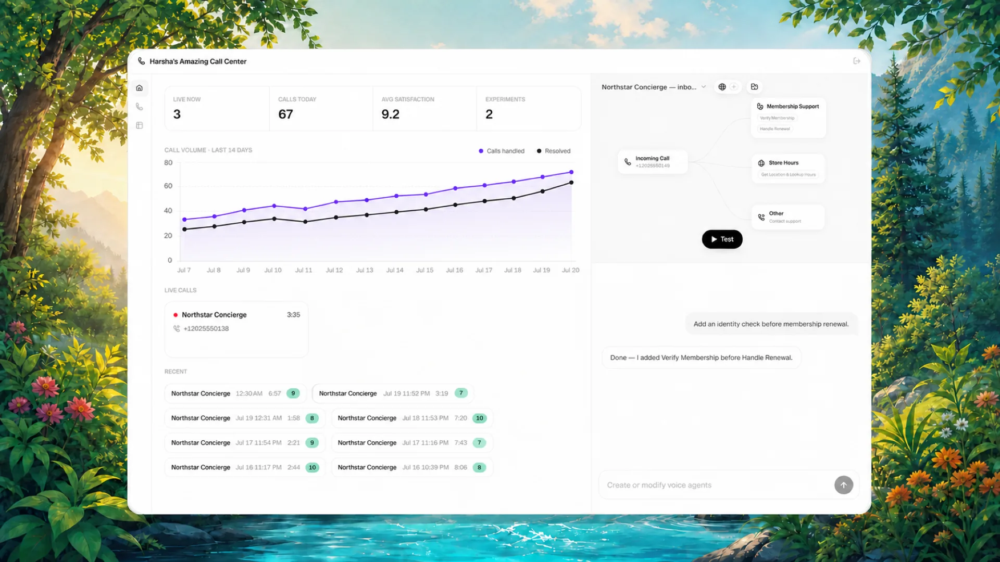
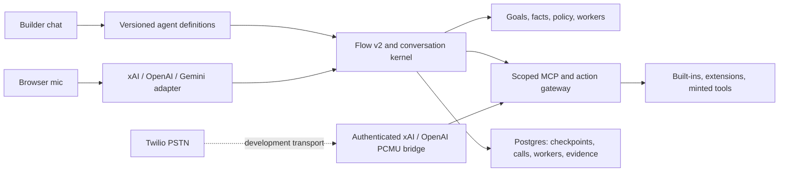

# Harsha's Amazing Call Center

An open, provider-neutral starting point designed to make long, tool-driven speech-to-speech workflows recoverable and enforceable.

Harsha's Amazing Call Center combines a visual builder, a high-authority builder agent, realtime browser calling, durable call records, extensible tools, datasets, knowledge retrieval, a deterministic Flow v2 runtime, and an event-sourced long-conversation kernel. It is designed for support, sales, intake, scheduling, education, field operations, personal assistants, and other realtime voice experiences—not only call centers.



*Illustrative product view with sanitized, simulated demo data—not a live deployment or benchmark result.*

## Why this exists

Large voice prompts and giant tool lists can make a model choose among unrelated actions, repeat work, lose state, and drift during long calls.

Flow v2 uses progressive disclosure instead:

1. The agent starts with one routing goal and a stable capability gateway.
2. `classify` selects a topic such as membership, returns, or scheduling.
3. `enter_step` reveals only the context and action schemas needed for the active nested step.
4. `run_action` accepts only a short-lived grant bound to this call, runtime snapshot, step attempt, capability epoch, and action.
5. `complete_step` derives typed durable outputs from successful action receipts instead of trusting an invented success ID.
6. Checkpoints let the agent recover after uncertainty or reconnection with `get_flow_state`.

The result is a repeatable state machine that still leaves the realtime model free to speak naturally.

## What you get

- Deep, recursive voice flows with machine-enforced output conditions, cross-topic transitions, failure paths, retries, receipt-bound outputs, checkpoints, and circuit breakers.
- An experimental [mission runtime](docs/mission-runtime.md) for multi-goal calls, safe detours, proof-carrying obligations, adaptive authority, saga compensation, and state-bound cross-channel continuation when one fixed flow is the wrong abstraction.
- A provider-neutral [durable conversation runtime](docs/durable-conversation-runtime.md): one PostgreSQL-backed hash-chained event authority, conflict-safe transactions, Flow checkpoint bindings, authority-stamped corrections, suspended/resumable goals, commitments, and deterministic byte-bounded realtime packets that fail closed on mandatory-state overflow.
- A deterministic action-policy firewall with argument/fact/receipt predicates, numeric limits, proposal/readback-bound confirmation, revision/epoch invalidation, postcondition quarantine, and provider-visible result projection. The governed reservation API locks Flow state, evaluates against database time and durable call count, and appends bounded decision evidence in the same transaction as an allowed receipt.
- A durable read-only worker substrate with immutable capability manifests, exclusive leases, heartbeats, cancellation epochs, crash recovery, cited results, and at-least-once delivery with exactly-once application. Governed spawn and result delivery are atomic with the conversation log. It is an integration primitive; the live `launch_task` MCP path has not yet been migrated to it.
- Atomic reserve-before-dispatch action receipts, step/call/argument idempotency policies, stale-call rejection, and explicit indeterminate-outcome recovery.
- Provider adapters for xAI Voice, OpenAI Realtime, and Gemini Live.
- Browser calling over WebSocket or WebRTC, plus a bounded, authenticated Twilio Media Streams transport bridge for xAI/OpenAI. The bridge remains development/non-production until release-commit provider, PSTN, load, and crash-loss artifacts exist.
- A scoped MCP gateway with expiring revision-bound capabilities and state-scoped tool allowlists.
- First-class extension manifests for voice tools and builder/operator tools.
- Generated edge-tool infrastructure, external MCP servers, datasets, document search, operator-approved email/SMS/calls, transfers, callbacks, campaigns, browser-call recordings, transcripts, and experiments. Builder-driven tool creation is currently withheld pending a funded-approval adapter.
- Immutable per-call runtime manifests and deterministic flow validation/scenario testing before deployment.
- A clean Next.js workspace driven by one builder chat interface.

## Integration status

| Surface | Current status |
|---|---|
| Flow v2, scoped MCP gateway, action receipts, and browser calling | Integrated into the current application path |
| xAI/OpenAI Twilio bridge | Implemented as a bounded development transport; not production-qualified |
| Durable conversation log, bounded context compiler, action-policy kernel, and governed worker store | Implemented and locally tested foundation; not yet the default provider/MCP path |
| Mission runtime and provider plugin contract | Experimental or opt-in; not release-critical runtime authority |

The default live path still uses Flow v2, the static provider registry, and the legacy `launch_task` implementation. The foundation APIs are available to integrators, but their existence is not evidence that live calls already receive durable context packets, governed worker results, or unified pre/post-action policy enforcement.

## Realtime provider matrix

| Provider | Default model | Browser | Experimental bridge transport | Tools |
|---|---|---|---|---|
| xAI | `grok-voice-think-fast-1.0` | WebSocket | Native 8 kHz PCMU | Local capability gateway |
| OpenAI | `gpt-realtime-2.1` | WebRTC | Native 8 kHz PCMU | Local capability gateway |
| Gemini | `gemini-3.1-flash-live-preview` | Ephemeral WebSocket | Not implemented; requires transcoding | Local capability gateway |

Model IDs are configuration, not hardcoded architecture. Pin versioned model IDs for reproducible deployments and benchmarks; aliases such as `grok-voice-latest` can change underneath a running test program. See [provider details](docs/providers.md).

### One lifecycle contract across different realtime APIs

The adapters do more than rename events. They project each provider's wire protocol into a fail-closed causal lifecycle: caller input, one logical tool call, the exact host result, a distinct post-tool continuation, its terminal event, response-scoped usage, and caller-playable output. OpenAI's repeated progress and terminal frames are accepted only when they describe one equivalent logical call; Gemini's provider-ID absence is retained honestly and bridged with a trigger-bound client-local continuation identity; and xAI's provider-native VAD boundary is proved with separately classified transport evidence rather than counted as caller speech. Missing, ambiguous, reordered, or contradictory evidence makes the execution ineligible for a passing roundtrip artifact.

These are horizontal integrity and replay abstractions, not claims that one provider behaves like another or that HACC improves model quality. See the [architecture](docs/architecture.md), [provider lifecycle details](docs/providers.md), and [frozen LC4 provider profiles](benchmarks/voice-long-horizon/LC4_PROVIDER_PROFILES.md).

## Evidence, not a superiority claim

The repository includes a [long-horizon reliability benchmark](benchmarks/voice-long-horizon/README.md), a [decision-to-evidence ledger](benchmarks/voice-long-horizon/DECISION_EVIDENCE.md), and executable claim gates. The current public boundary is:

- **C1:** in a frozen 18-snapshot census, a representative 64-tool flow exposed eight relevant business tools per active phase, reduced the corresponding canonical business-entry array by a median 87.5094%, rejected flat disclosure above the configured budget, and leaked no tested private authority fields. This measures serialization and containment—not provider token billing, reachability, or model behavior.
- **C2:** across 1,000 deterministic seeded fault schedules, the intentionally unenforced controller passed 245 while the mission runtime passed 1,000; a separate fixed ToolWorld suite contained 160/160 unsafe schedules. These are synthetic/offline engineering comparisons, not raw voice-model experiments.
- **C3, historical v14 canary:** 18 scheduled cells produced 104 completed voice-to-voice turns. Gemini tied at 2/3 raw and 2/3 harness; xAI tied at 3/3 and 3/3; OpenAI rejected all sessions for quota. That batch did not include independent audio-semantic scoring. See its [sanitized aggregate evidence](benchmarks/voice-long-horizon/evidence/usefulness-live-canary-v14.aggregate.json).
- **Latest paid evaluator-development batch (HACC-LC3-v6):** 18 production-API episodes, nine matched pairs, yielded Native 0/9 versus HACC 0/9 for both mission completion and strict alignment. Only 8/18 episodes reached all 20 turns (Native 5/9, HACC 3/9). The batch exposed evaluator, output-voice calibration, playback, and provenance defects, so it is retained for mechanism discovery and cannot support a public efficacy graph. See the [immutable result receipt](benchmarks/voice-long-horizon/evidence/HACC_LC3_V6_RESULTS.md).
- **Output-voice evaluator calibration:** 54 production calibration utterances were retained across three development batches. The final provider-neutral spoken form and pinned local `large-v3-turbo-q5_0` ASR passed 18/18 exact provider/model/voice fixtures with 0/144 normalized word errors, zero critical-slot false negatives, and zero false positives. This makes the output-voice evaluator admissible for a future frozen run; it is not evidence that HACC outperforms Native. See the [complete calibration trail](benchmarks/voice-long-horizon/evidence/HACC_LC4_OUTPUT_VOICE_CALIBRATION.md).
- **Context-substrate evidence:** across 1,000 seeded 500–2,000-turn schedules, a 2,048-byte kernel packet retained 13,000/13,000 registered policy, goal, fact, correction, and commitment units. An equally byte-bounded recent-turn window retained 83/13,000; unbounded history averaged 116,110 bytes. At 1,024 bytes the kernel failed closed on all 1,000 schedules instead of silently dropping control state. This is a deterministic retention comparison, not an STS model result. See [method and limits](benchmarks/voice-long-horizon/CONTEXT_KERNEL_RETENTION_V1.md).
- **C4/C5:** unavailable. This repository does not claim that models remember better, drift less, or that the framework outperforms raw OpenAI, xAI, Gemini, or voice agents generally.

See [claim readiness](benchmarks/voice-long-horizon/CLAIM_READINESS_AUDIT.md) and the machine-readable [offline validation artifact](benchmarks/voice-long-horizon/OFFLINE_NUMERICAL_VALIDATION.json) for exact hashes, methods, and limitations.

## Architecture



- `web/` — Next.js app, API routes, builder, flow/runtime kernels, providers, MCP, data layer, and 35 ordered migrations (`001`–`035`). See the [runtime API guide](docs/conversation-runtime-api.md).
- `bridge/` — optional standalone Twilio Media Streams bridge. The legacy in-app `/api/bridge` compatibility route is disabled by default and cannot be enabled in production.
- `examples/` — the tested [deep Flow v2 example pack](examples/flows/README.md) and a multi-goal mission example.
- `docs/` — architecture, provider, flow, and extension guides.

## Quick start

Prerequisites: Node.js 22.13.0 (pinned in `.node-version` and `.nvmrc`). Supported runtimes are Node.js 20.19.x, 22.13.x or newer 22.x releases, and Node.js 24+. You also need npm, Docker, `XAI_API_KEY` for the current builder/onboarding chat, and a key for the realtime provider you want to call.

```bash
git clone https://github.com/harshag1/CallCenter.git harsha-amazing-call-center
cd harsha-amazing-call-center
docker compose up -d --wait db
cp web/.env.example web/.env.local
```

Generate four independent secrets and add them to `web/.env.local`:

```bash
openssl rand -hex 32  # AUTH_CODE_HMAC_SECRET
openssl rand -hex 32  # MCP_GATEWAY_SECRET
openssl rand -hex 32  # CAMPAIGN_COMMITMENT_SECRET
openssl rand -hex 32  # ENV_VAULT_MASTER_KEY
```

Paste those values into the matching blank entries. Configure `XAI_API_KEY`, `OPENAI_API_KEY`, or `GEMINI_API_KEY`, and explicitly set the following only when you accept spending your own provider key during local development:

```bash
# web/.env.local
PUBLIC_ORIGIN=http://localhost:3000
ALLOW_DEV_DEPLOYMENT_FUNDED_AI=true
```

The flag is effective only outside production with a plain-HTTP loopback `PUBLIC_ORIGIN` (`localhost`, `127.0.0.1`, or `[::1]`). It permits local builder, onboarding-AI, and browser-session provider spend; production and non-loopback origins ignore it. This release does not yet provide tenant-scoped BYOK or a durable provider-budget authority for those routes.

Then run:

```bash
cd web
npm ci
npm run db:migrate
npm run dev
```

For local login, either configure Resend or add the terminal-only OTP opt-in to `web/.env.local` before starting the app:

```bash
# web/.env.local — local development only; ignored in production.
ALLOW_DEV_OTP_STDOUT=true
```

Outside that exact loopback, stdout-only development exception, anonymous email OTP requires a trustworthy request-source boundary. Vercel selects its platform-overwritten `x-vercel-forwarded-for` automatically. A self-hosted deployment must set `AUTH_TRUSTED_CLIENT_IP_HEADER` to an allowed IP header its own edge overwrites; arbitrary client-supplied forwarding headers are unsafe. Without either boundary, OTP issuance fails closed with `429` before generating or sending a code.

Open [http://localhost:3000](http://localhost:3000). The builder/operator chat currently uses xAI chat, so configure `XAI_API_KEY` to use that interface even when the live voice provider is OpenAI or Gemini.

Gemini browser calls can run under the loopback-only development opt-in. xAI/OpenAI browser calls require a non-loopback public HTTPS gateway, while the deployment-funded session route intentionally denies non-loopback origins. Their browser transports are implemented, but exercising them through the stock web route now requires replacing that boundary with reviewed tenant BYOK or durable provider-budget authority; copying the development flag to a tunnel or deployment will not work.

Keep any tunnel access-restricted. The stock email-OTP flow is demo self-registration: any verified email becomes a high-authority operator, and the builder includes spend-bearing and server-side tools. Read [SECURITY.md](SECURITY.md) before making the app reachable from the public internet.

The included standalone bridge can be used for local transport experiments with Twilio and xAI/OpenAI:

```bash
cd bridge
npm ci
APP_ORIGIN=https://your-app.example \
BRIDGE_PUBLIC_STREAM_URL=wss://your-bridge.example/stream \
TWILIO_ACCOUNT_SID=AC... \
TWILIO_AUTH_TOKEN=... \
OPENAI_API_KEY=... \
npm start
```

Use `XAI_API_KEY` instead of `OPENAI_API_KEY` for xAI. Set the web application's `BRIDGE_WS_URL` to that same canonical public `/stream` URL. Browser-only agents do not need Twilio or the bridge.

> **Bridge safety boundary:** `bridge/server.js` verifies the Twilio upgrade, consumes a one-use call-bound bootstrap credential, bounds queues/state, rotates separate event/MCP/renewal capabilities, and routes provider tool calls through the application gateway. It is still classified development/non-production because local protocol tests do not establish live provider/PSTN compatibility, multi-instance behavior, load limits, or acceptable crash loss for its in-memory journal. Follow the [bridge runbook](bridge/RUNBOOK.md) and preserve that classification until its release packet exists.

## Optional integrations

| Integration | Configure | Boundary |
|---|---|---|
| xAI browser voice | `XAI_API_KEY` | Ephemeral browser transport implemented; stock funded-session route cannot satisfy both its public-gateway requirement and loopback-only spend gate |
| OpenAI browser voice | `OPENAI_API_KEY` | WebRTC transport implemented; stock funded-session route cannot satisfy both its public-gateway requirement and loopback-only spend gate |
| Gemini browser voice | `GEMINI_API_KEY`, loopback development spend opt-in | Single-use Live token; default `gemini-3.1-flash-live-preview`; no production BYOK path yet |
| Resend | `RESEND_API_KEY`, verified `EMAIL_FROM` | Send API acceptance is not inbox delivery; operator-composed email requires exact browser approval |
| Twilio | Account SID, inbound auth token, restricted REST API key, owned number, `TELEPHONY_RECEIPT_SECRET`, `BRIDGE_WS_URL` | Inbound signatures and outbound authority are separate; provider acceptance is not call/SMS delivery |

Provider-specific setup and model caveats are in [docs/providers.md](docs/providers.md). Twilio bridge variables and deployment controls are in [bridge/RUNBOOK.md](bridge/RUNBOOK.md).

Optional operator/generated-tool network surfaces have a separate global production egress acknowledgement and exact per-capability flags in `web/.env.example`. Those switches are not budget authority, tenant BYOK, or evidence that a destination is safe. The builder's `create_tool` primitive is unavailable until a funded-approval adapter exists; deterministic local onboarding remains available without provider egress.

## Build a reliable flow

Start with the tested [deep Flow v2 example pack](examples/flows/README.md). It includes service-appointment, warranty/incident, and membership/return workflows with four-level paths, receipt-bound mutations, checkpoints, progressive tool exposure, and explicit integration limitations. The smaller illustrative [membership-and-returns.json](examples/flows/membership-and-returns.json) is useful when you want the minimum schema surface.

> Build a Flow v2 membership and returns agent. Keep routing tools minimal, verify identity before account actions, require durable IDs from every write, checkpoint after verification, add explicit failure paths, validate the flow, and list the action fixtures needed for receipt-backed scenario tests before attaching it.

The builder's `validate_flow` primitive performs executable schema/topology checks. `test_flow_scenario` can walk receipt-free state transitions, but it does not currently synthesize action receipts; receipt-bound flows need action fixtures or integration tests. See [Flow v2](docs/flow-v2.md).

## Extend it

- Add a self-hosted live-call tool in [`web/lib/voice-tools/extensions.ts`](web/lib/voice-tools/extensions.ts).
- Add a tenant-scoped builder/operator primitive in [`web/lib/agent/tools/extensions.ts`](web/lib/agent/tools/extensions.ts), starting from the compiling [membership-summary extension](examples/operator-tools/membership-summary.ts).
- Build an adapter against the [Realtime Provider Plugin v1 contract](web/lib/realtime/plugins/README.md), then install its server-facing runtime adapter with `registerRealtimeProvider(...)` during self-hosted server bootstrap. Registration is typed for custom string-literal IDs, rejects duplicates and capability/hook mismatches, protects the bundled OpenAI/xAI/Gemini adapters, and makes extensions visible to the provider catalog without editing a core switch. A custom browser provider still needs a matching client-side transport consumer; registration stays server-only so credentials and adapter code cannot enter the browser bundle.
- Build an email/SMS/voice/number adapter against the [Communication Provider Adapter v1 contract](web/lib/communications/README.md). Twilio and Resend have not migrated to it and are not configuration-swappable through that contract yet.
- Register setup metadata in [`web/lib/integrations/registry.ts`](web/lib/integrations/registry.ts).
- Connect a remote MCP server with the builder's `add_mcp_server` tool.

Full walkthrough: [extending tools](docs/extending-tools.md).

## Verification

```bash
cd web
npm run check
npm run build
```

`npm run check` runs Vitest, ESLint, and TypeScript. Run it from a clean checkout before deployment; focused tests passing in one subsystem are not a substitute for this repository-wide gate.

The default command intentionally skips 21 PostgreSQL integration suites (59 tests) unless their disposable-database environments are supplied: `FLOW_INTEGRATION_DATABASE_URL`, `AUTH_SECURITY_INTEGRATION_DATABASE_URL`, `CREDENTIAL_VAULT_INTEGRATION_DATABASE_URL`, and `SECURITY_MIGRATION_INTEGRATION_DATABASE_URL`. Release verification must run those suites and the separate `npm run db:test-isolation` proof; see [database tenancy](docs/database-tenancy.md).

Reproduce the checked-in `$0` benchmark claims without opening a provider session:

```bash
npm run benchmark:claims:verify
npm run benchmark:context-kernel -- --schedules 1000 --seed 1212236611
npm run benchmark:mission-runtime -- --trials 1000 --seed-start 1 --out ../benchmarks/voice-long-horizon/.local/mission-runtime-local.json
npm run benchmark:active-catalog -- --out ../benchmarks/voice-long-horizon/.local/active-catalog-local.json
```

The benchmark [README](benchmarks/voice-long-horizon/README.md) defines what these results do and do not establish.

The example database URL uses plaintext only for local loopback Docker. Production and remote databases use `DATABASE_SSL=verify-full`; connection-string TLS parameters such as `sslmode` are rejected so they cannot override the application policy.

## Security posture

- Provider API keys stay server-side; the supplied browser-session routes mint short-lived provider credentials rather than returning root keys.
- MCP call scopes and Flow v2 action leases are domain-separated, expire, and use timing-safe signature verification.
- Flow v2 rejects ungranted, stale, or disallowed duplicate actions, and rejects receipt-bound completion values without authoritative evidence from the current attempt.
- Agent-triggered hangup is gated on terminal state and settled effects; background tasks cannot inherit realtime leases or controls.
- External MCP authorization is encrypted at rest.
- Generated Vercel deployment is disabled by default. `ENABLE_TOOL_FACTORY` and egress flags configure infrastructure only; they do not make `create_tool` model-callable or substitute for funded approval.
- Public raw-SQL tools are disabled; builder data reads use fixed tenant-scoped queries and writes use dataset APIs.
- Minted tools, external MCP, telephony, communication, and optional external-code execution remain high-authority surfaces. Deploy behind trusted operator admission and review [SECURITY.md](SECURITY.md).

## Project status

This is an ambitious starting point, not a hosted compliance product. The conversation kernel, action-policy kernel, and worker store are implemented and locally tested primitives, but they are not yet one transactionally unified live-call path: Flow v2 remains the production action authority, the old `launch_task` implementation remains live, and worker-result delivery is not yet projected into provider context. Do not describe the architecture target as production integration. Gemini Live and its ephemeral tokens are preview APIs. Gemini PSTN is not implemented and requires a tested transcoding bridge. Provider-native resumption is not treated as workflow authority; durable checkpoint recovery is application-owned. The included Twilio bridge is development/non-production for the evidence gaps above. Recording persistence is implemented for browser calls only—neither Twilio bridge path records PSTN audio. Operators must add admission policy, rate limiting, retention, consent, audit, incident response, and jurisdiction-specific controls before a public or consequential deployment.

## Contributing

Issues and focused pull requests are welcome. Read [CONTRIBUTING.md](CONTRIBUTING.md), the [Code of Conduct](CODE_OF_CONDUCT.md), [support boundaries](SUPPORT.md), and [SECURITY.md](SECURITY.md). Licensed under the [MIT License](LICENSE).
