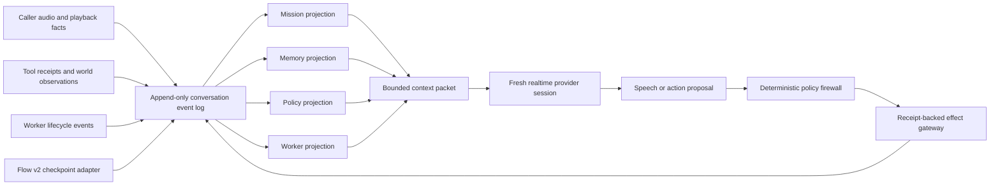

# Durable conversation runtime

Status: implemented shared-state foundation, not yet the default live-call path or a provider-superiority claim.

## Implementation snapshot

As of July 21, 2026, the repository contains these independently testable and partially integrated slices:

- `web/lib/conversation-kernel.ts` implements the pure hash-chained log, authority-stamped revisions, suspend/resume goals, commitments, worker-result admission, deterministic projection, and typed `context_overflow` behavior.
- `web/lib/action-policy-kernel.ts` implements pure revision-bound pre/post action decisions and readback-bound confirmation evidence.
- migration `033` plus `web/lib/conversation-store.ts` persists the one-log authority with organization-scoped reads, 1–64 event compare-and-append transactions, exact replay, and conflict rejection. `web/lib/conversation-runtime.ts` adds semantic pre-validation and bounded conflict/replan behavior.
- `web/lib/flow-conversation-adapter.ts` binds Flow revision, capability epoch, runtime digest, unresolved receipts, and full-state digest into the conversation log. `web/lib/realtime-context-packet.ts` compiles policy, current facts and corrections, goals, commitments, Flow checkpoint, worker status, host-derived capabilities, and recent caller-heard turns under one byte budget.
- migrations `032` and `034` plus `web/lib/voice-workers/*` implement the durable read-only worker queue and atomically couple governed spawn/result delivery to the conversation event log.
- migration `035` plus `reserveGovernedFlowActionAtomic` locks current Flow/call authority, evaluates the policy kernel using database time and durable dispatch count, and persists an immutable bounded decision record in the same transaction as an allowed reservation.

The important remaining boundary is wiring, not an omitted authority design: the current MCP gateway still calls the legacy Flow reservation and xAI-based `launch_task` paths, provider sessions do not yet receive packets from the durable compiler, and spoken-output safety has not been implemented. Therefore this foundation must be shadowed on live calls before it replaces the current route. Do not describe it as production-complete or as a general realtime guardrail.

The checked-in [context retention result](../benchmarks/voice-long-horizon/CONTEXT_KERNEL_RETENTION_V1.md) measures the pure projector only. HACC-VMR-v1 has no provider effectiveness result.

This document defines the provider-neutral runtime Harsha's Amazing Call Center is building toward for conversations that last longer than one model context, cross provider connections, interleave several goals, enforce consequential-action policy in real time, and launch work that may finish after the caller has moved on or disconnected.

The central design choice is simple: **the provider session is a replaceable speech interface, not the source of truth for the conversation**. One application-owned event log is the write authority. Every useful view of the conversation is a deterministic projection of that log, and every external effect crosses a policy and receipt boundary that the model cannot mint for itself.

This is a proposed successor layer around the existing Flow v2 and experimental mission primitives. It is deliberately incremental: Flow v2 remains valuable for known, repeatable subflows, while the durable runtime supplies conversation-wide memory, policy, workers, and recovery.

## Design goals

The runtime should make these cases ordinary rather than exceptional:

- an hour-scale conversation split across several realtime provider sessions;
- two active requests, one suspended detour, and a later return to the exact prior goal;
- a caller correction that invalidates an earlier confirmation and every stale action derived from it;
- a background investigation that completes 30 turns later or after reconnect;
- a timeout after a downstream mutation, where retry safety is unknown;
- a barge-in where generated audio was not fully heard and must not become caller-visible fact;
- a bounded model context that still contains every fact, obligation, constraint, and worker result needed for the next decision.

The runtime does not try to make the model remember better by repeatedly pasting a growing transcript. It keeps durable state outside the model and compiles the smallest sufficient packet for the current turn.

## One log, multiple heads

Every accepted state transition is appended to one per-conversation, hash-chained event log. The log is the only durable write authority. The four runtime heads are pure folds over a prefix of that log:

1. **Mission head** — active, suspended, completed, and abandoned goals; the single focused goal; obligations; Flow v2 checkpoint references.
2. **Memory head** — revisioned typed facts, provenance, supersession links, confidence, expiry, and advisory summaries.
3. **Policy head** — currently admissible capabilities, pending proposals, confirmation evidence, leases, denials, and revocations.
4. **Worker head** — durable jobs, attempts, leases, heartbeats, results, cancellation, delivery, and application status.



Heads never write independently. A projector can be rebuilt from the genesis event and must produce the same canonical digest on every supported runtime. A Flow v2 transition is recorded through an adapter into the same log; a second Flow-only persistence path may exist temporarily for compatibility, but it cannot confer conversation-wide authority and must be reconciled against the log before execution.

### Event envelope

Every event should carry at least:

```ts
type ConversationEvent = {
  event_id: string
  conversation_id: string
  sequence: number
  occurred_at: string
  event_type: string
  actor: "caller" | "provider" | "kernel" | "tool" | "worker" | "operator" | "system"
  causation_id: string | null
  correlation_id: string | null
  idempotency_key: string | null
  previous_event_hash: string
  payload_hash: string
  event_hash: string
  schema_version: number
  payload: unknown
}
```

The append transaction enforces the next sequence and prior hash. Duplicate delivery with the same idempotency identity returns the original event; a conflicting payload under the same identity fails closed. Wall-clock timestamps are useful telemetry but never establish ordering authority.

## Authority boundaries

The runtime separates proposals, evidence, authority, execution, and settlement.

| Component | May do | Must not do |
|---|---|---|
| Realtime model | Propose speech, fact candidates, goal changes, tool arguments, worker requests | Grant itself a capability, declare a receipt successful, promote a summary to authoritative memory |
| Provider adapter | Move audio/events, normalize provider tool calls, report provider acknowledgements | Decide policy, infer that generated audio was heard, replay hidden provider history as durable truth |
| Conversation kernel | Append validated events, fold heads, compile packets, verify current digests | Perform arbitrary external effects |
| Policy firewall | Admit or reject a proposal against current heads and issue a short-lived lease | Dispatch an action or trust model-supplied epochs/grants |
| Effect gateway | Reserve a receipt, dispatch once for the reservation owner, settle or mark indeterminate | Retry an uncertain mutation without downstream idempotency or reconciliation proof |
| Worker executor | Claim a durable job, heartbeat, produce a content-addressed result | Inject a result directly into model context or bypass delivery-time policy |
| Context projector | Select and render bounded, provenance-labelled state | Create new authoritative facts or omit registered blocking obligations silently |

The canonical model-visible action remains only:

```json
{"tool_name":"logical_action_name","arguments":{}}
```

Grant, lease, capability epoch, head digest, risk, confirmation, idempotency key, and receipt identity are host-derived metadata. They are never accepted from model arguments.

### Fact authority

Memory entries have explicit authority classes:

- `tool_receipt`: authoritative for fields covered by a pinned read or settled mutation;
- `caller_confirmed`: authoritative only for caller-owned facts, bound to the exact heard proposal or readback;
- `operator`: authoritative within the operator's declared scope;
- `policy`: versioned policy fact from a pinned policy artifact;
- `model_advisory`: useful extraction or summary with no independent authority;
- `provider_transcript`: advisory evidence about audio, never proof of what was heard.

Corrections create a new fact revision and a `supersedes` edge. They do not mutate old history. Any correction to a fact used by a pending proposal increments the authority epoch and revokes that proposal and its lease.

## Context tiers

The context compiler works from durable state, not from a transcript dump. It has five tiers:

| Tier | Contents | Retention and authority |
|---|---|---|
| T0 — media edge | Current input audio, partial turn detection, output playback cursor | Ephemeral; exact byte/range hashes retained as evidence |
| T1 — conversational working set | Small recent window of caller-heard turns, unresolved references, interruption repair | Bounded and replaceable; never authoritative by itself |
| T2 — active mission packet | Focused goal, current Flow step, blockers, obligations, permissible actions, relevant worker status | Recompiled at every authority-changing event |
| T3 — durable typed state | Revisioned facts, receipts, decisions, goal ledger, worker results, policy versions | Application-owned source of truth derived from the event log |
| T4 — cold evidence | Full transcript/audio references, provider events, old summaries, superseded facts | Content-addressed archive; retrieved only through an explicit query with provenance |

The packet budget is fixed by provider/configuration before a run. Selection is deterministic and fails closed if mandatory items do not fit. It must include, in order:

1. current policy and packet schema identities;
2. focused goal and resumable-goal stack;
3. open blocking obligations and deadlines;
4. authoritative facts required by the focused goal, including corrections;
5. pending proposal or confirmation readback;
6. worker completions eligible for delivery and outstanding worker status;
7. current Flow v2 step disclosure, if a subflow is active;
8. exact currently callable logical actions and their schemas;
9. a bounded conversational working set.

Optional material is removed before mandatory state. If mandatory state exceeds the budget, the kernel enters `context_overflow`, exposes only safe recovery/escalation actions, and never silently drops a blocker.

### Projector quality is a release property

A deterministic projector can be perfectly consistent and still forget the important fact. For that reason, projector validation must measure both:

- **integrity:** byte stability, replay equivalence, provenance preservation, and no stale revision selection;
- **recall:** whether every registered future-relevant fact, correction, obligation, and worker result appears by its first required opportunity under the frozen byte budget.

Model-written summaries stay advisory. Promotion requires a typed extraction plus acceptable authority evidence; a fluent summary cannot overwrite a receipt.

## Realtime policy firewall

The model can request an action, but only the firewall can admit it. Admission is a pure decision over a named proposal and exact current head digests.

1. Normalize `{tool_name, arguments}` against the pinned schema.
2. Resolve the focused goal, current Flow step, facts, obligations, worker state, and policy version.
3. Evaluate preconditions and risk rules.
4. For confirmation-required actions, create a proposal digest that binds action, arguments, subject, goal, relevant fact revisions, and intended effect.
5. Accept confirmation only after the proposal was rendered and heard. High-consequence confirmation includes a distinguishing-detail readback.
6. Issue a short-lived, single-use execution lease bound to the proposal digest, authority epoch, head digests, and expiry.
7. Re-read the current heads immediately before receipt reservation. Any digest advance that affects the decision invalidates the lease.
8. Reserve, dispatch, and settle through the effect gateway.

This closes the time-of-check/time-of-use gap. A worker completion, caller correction, operator intervention, Flow transition, or policy update between steps 6 and 7 forces re-evaluation.

Policy outputs are machine-readable decision artifacts:

```ts
type PolicyDecision = {
  decision: "allow" | "deny" | "confirm" | "defer" | "escalate"
  reason_codes: string[]
  proposal_digest: string
  bound_head_digests: Record<string, string>
  capability_epoch: number
  lease_id?: string
  expires_at?: string
  required_readback?: string[]
}
```

## Durable asynchronous workers

Workers are conversation primitives, not fire-and-forget tool calls. A live model requests work; the kernel decides whether to create a job; an executor performs it independently; the conversation receives the result only after current-state policy admits delivery.

### Lifecycle

```text
proposed -> admitted -> queued -> claimed -> running
running -> succeeded | failed | indeterminate | cancelled
succeeded -> delivery_pending -> delivered -> applied
delivery_pending -> deferred | quarantined
```

- `admitted` binds the job definition, input hash, goal/fact revisions, creator policy decision, deadline, visibility, and semantic idempotency key.
- `claimed` creates one expiring lease. Executors heartbeat and include the lease generation in every completion attempt.
- An expired lease permits another claim. Therefore execution is at least once unless the downstream system provides stronger semantics.
- Results are immutable content-addressed artifacts. A conflicting result for one attempt is quarantined.
- Delivery is **at least once; application is exactly once** by `(job_id, result_hash, delivery_revision)`.
- Before delivery, the policy firewall evaluates the result against current mission, memory, and policy heads. A result for a superseded goal may be deferred, summarized without authority, or quarantined; it is never injected merely because the job succeeded.
- Cancellation is a request, not proof that execution stopped. A completion racing with cancellation is retained and policy-evaluated.
- A post-dispatch timeout is `indeterminate`. Reconciliation, not blind retry, determines the terminal result.

The caller-facing agent can continue while work runs. The active packet contains only the minimum worker state needed now: promised outcome, status, deadline, and any eligible result. Large artifacts remain in cold storage behind explicit retrieval.

## Session boundaries and reconnects

**Default rule: every reconnect creates a fresh provider session and sends one newly compiled packet from the durable heads.** Provider-cached history is not resumed.

This avoids dual history: a provider replay could contain a fact or confirmation that the application has since superseded. It also gives all providers one portable recovery contract. The new session records its predecessor, packet digest, event-log prefix, and runtime manifest.

Provider-native resumption may be enabled later only as a declared optimization with a tested `delta_only` contract:

- the adapter proves which provider history prefix will be replayed;
- the injected packet contains only a non-conflicting delta;
- the kernel verifies no authoritative correction or revoked confirmation conflicts with replayed history;
- unsupported or unverifiable cases fall back to a fresh session;
- effectiveness evidence reports resume and fresh-session strata separately.

This default is intentionally stricter than provider capability. OpenAI documents stateful Realtime sessions, mutable session configuration, function calling, and a 60-minute session limit; it also requires WebSocket clients to handle playback truncation on interruption ([Realtime conversations](https://developers.openai.com/api/docs/guides/realtime-conversations), [`gpt-realtime-2.1`](https://developers.openai.com/api/docs/models/gpt-realtime-2.1)). Gemini documents roughly ten-minute connection turnover, 15-minute audio-only sessions without compression, sliding-window context compression, and resumable handles that can be unavailable while generation or function calls are in progress ([session management](https://ai.google.dev/gemini-api/docs/live-api/session-management), [Live API reference](https://ai.google.dev/api/live)). xAI documents function calling, a 120-minute maximum Voice Agent session, and optional provider resumption ([Voice Agent API](https://docs.x.ai/developers/models/voice-agent-api), [voice agent guide](https://docs.x.ai/developers/model-capabilities/audio/voice-agent)). These are transport features, not substitutes for application-owned authority.

Provider facts in this section were checked against official documentation on July 21, 2026 and should be rechecked before a release or benchmark pin.

## Spoken-output scope

The first runtime slice guards action authority and durable state. It does **not** yet prove that spoken output obeys privacy, safety, disclosure, or truthfulness policy.

Provider transcripts are not proof of what a caller heard. A spoken-output claim requires:

- the exact ordered output PCM chunks and their aggregate hash;
- playback start, played-through ranges, interruption, and truncation repair;
- independent ASR/alignment with frozen model/version/settings;
- a calibrated semantic policy detector or blinded human labels;
- `unverifiable` for missing or low-confidence evidence;
- a policy action for pre-playback blocking, post-playback incident handling, or both.

Until that layer exists, say “tool-effect policy firewall,” not “all realtime guardrails.” The model may still speak an unsafe sentence even when the gateway blocks the related tool call.

## Public API direction

The checked-in runtime already exposes the one-log transaction and packet compiler through `defineConversationRuntime`, PostgreSQL persistence functions, Flow checkpoint construction, governed action admission, and governed worker transitions. The [runtime API guide](conversation-runtime-api.md) shows the exact imports and current wiring boundary. The intended surface remains small provider-neutral primitives instead of a monolithic agent object:

```ts
defineConversationRuntime({ eventStore, policy, projector, workers, gateway })

appendConversationEvent(conversationId, expectedHead, event)
replayConversation(conversationId, throughSequence?)
projectConversationHeads(events)
compileContextPacket(heads, budget, providerProfile)

proposeAction(conversationId, toolName, arguments)
evaluatePolicy(conversationId, proposalId)
confirmProposal(conversationId, proposalDigest, heardEvidence)
executeLease(conversationId, leaseId)
reconcileReceipt(conversationId, receiptId)

spawnWorker(conversationId, workerType, input, options)
cancelWorker(conversationId, jobId, reason)
recordWorkerHeartbeat(jobId, leaseGeneration)
settleWorkerAttempt(jobId, leaseGeneration, result)
deliverWorkerResult(conversationId, jobId, resultHash)

activateGoal(conversationId, goal)
suspendGoal(conversationId, goalId, reason)
resumeGoal(conversationId, goalId)
recordFactRevision(conversationId, fact, authorityEvidence)
recordFlowCheckpoint(conversationId, checkpoint)

openRealtimeSession(conversationId, providerProfile)
rotateRealtimeSession(conversationId, reason)
recordPlaybackRange(conversationId, audioArtifact, range)
```

Every mutating call takes an expected head or derives one transactionally, returns the appended event identity and new head digest, and is safe to redeliver under an idempotency key. Provider adapters depend on these primitives; the primitives never depend on provider-specific conversation history.

## Delivery sequence and proof gates

No phase inherits a stronger evidence claim than its proof.

| Gate | Deliverable | Required proof | Permitted statement |
|---|---|---|---|
| D0 — architecture freeze | Event schemas, authority table, packet budget, worker semantics, reconnect rule | Review plus versioned protocol hashes | Design only |
| D1 — pure kernel | Append/replay, four folds, packet compiler, policy decisions | Property tests; mutation tests; hash-chain tamper detection; 1,000 then 10,000 adversarial schedules | Deterministic invariant evidence |
| D2 — projector and worker faults | Recall corpus; lease expiry; duplicate claim/delivery; stale completion; correction races | Needle recall by required opportunity; exactly-once application; zero unsafe effect in seeded schedules | Seeded containment evidence |
| D3 — text paired pilot | Same model/information/tools/world, native-memory versus runtime packet | Preregistered paired result; held-out scenario split; full ITT accounting | Exploratory text evidence only |
| D4 — shared-state integration | Event store migration, Flow adapter, production-shaped worker queue, gateway wiring | Concurrency, crash/replay, RLS/tenancy, migration rollback, shadow traffic | Integration readiness |
| D5 — provider transport | One content-addressed audio/tool/reconnect canary per exact provider pin | Requested-versus-acknowledged identity, PCM and playback evidence, complete replay | Exact transport compatibility |
| D6 — long-horizon paired voice pilot | [HACC-VMR-v1](../benchmarks/voice-long-horizon/VMR_180_PROTOCOL.md) development templates | Provider-stratified paired outcomes and uncertainty; no selective retry | Exploratory voice evidence |
| D7 — held-out confirmation | Powered independent templates, frozen scorer and analysis, sealed arm labels | Independent replay, audio-semantic evidence, multiplicity and missingness plan | Only claims directly supported by the registered endpoints |

The first falsifiable milestone is not a UI demo. It is D1–D3: prove that a bounded packet preserves future-relevant state better than an equally informed native-memory baseline without increasing critical action errors, then decide whether database and paid voice integration are warranted.

## Evidence and advisory boundary

The saved [Fable review](research/external/2026-07-21-durable-voice-runtime-fable.md) is unverified advisory input, not repository evidence. Its strongest useful challenges shaped this implementation: one event-log authority rather than independently persisted heads; delivery-time policy re-evaluation; at-least-once worker delivery with exactly-once application; fresh-session-plus-packet as the reconnect default; projector recall as a measured property; and explicit exclusion of spoken-output safety from the first slice. Only the behaviors covered by checked-in tests and artifacts are evidence.

Likewise, the existing mission-runtime tests and prior benchmark artifacts support narrower deterministic invariants only. They do not establish hour-scale provider reliability or an advantage over native OpenAI, Gemini, or xAI agents.
