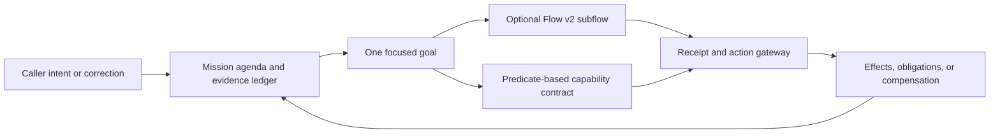

# Mission runtime (experimental)

Flow v2 is excellent when the work has a known route. Real conversations are not always one route: a caller corrects an authoritative fact, asks for a second thing halfway through, postpones an obligation to SMS, or reaches a partial multi-system commit that must be compensated.

The mission runtime is an experimental, flow-independent kernel for those cases. It does not generate a hidden plan and ask the model to remember it. It persists five explicit ledgers:

1. **Goals** — a focus stack of active, suspended, completed, and safely abandoned goals. A declared detour suspends the prior goal and does not union both goals' authority.
2. **Facts** — revisioned values with caller/tool/policy/operator/system provenance. A correction or authority change revokes every outstanding action proposal.
3. **Obligations** — work that remains owed to the caller or another system, with an owner and the earliest boundary it blocks. Saying “I will text that” becomes executable state, not conversational flavor.
4. **Action proposals and receipts** — arguments, idempotency scope, risk, confirmation evidence, current authority epoch, settlement, and indeterminate outcomes.
5. **Events** — a deterministic hash chain over every state transition.

This makes Flow v2 one possible compiler into a broader conversation kernel rather than the only orchestration model.

## What it unlocks

- **Safe detours:** handle a scheduling question during a repair call, then resume the exact repair goal. Only the focused goal's actions are available.
- **Adaptive authority:** action availability is recomputed from authoritative evidence. Caller assertions cannot satisfy a predicate that requires a tool receipt.
- **Fresh confirmation:** high-risk confirmation binds the exact proposal digest and must be observed after the proposal. Any later correction revokes it before execution.
- **Proof-carrying promises:** successful actions can open obligations such as “send confirmation.” Goal and mission completion fail while required obligations remain open.
- **Saga compensation:** a failed later step can open a narrowly scoped compensation obligation and disclose only its declared compensation action.
- **Cross-channel continuation:** a short-lived HMAC continuation binds subject, exact mission-state digest, source channel, allowed target channels, and expiry. Progress invalidates the old continuation.

The implementation is in [`web/lib/mission-runtime.ts`](../web/lib/mission-runtime.ts). A multi-goal example is in [`examples/missions/field-service-multigoal.json`](../examples/missions/field-service-multigoal.json).

## Minimal lifecycle

```ts
let state = createMissionState(definition);
state = activateMissionGoal(definition, state, {
  goal_id: "repair",
  mode: "root",
});

state = recordMissionFact(definition, state, {
  fact_id: "identity_verified",
  value: true,
  authority: "tool",
  evidence_id: "receipt:identity-123",
});

const proposed = proposeMissionAction(definition, state, {
  action: "close_order",
  arguments: { work_order_id: "WO-2048" },
});

state = authorizeMissionAction(definition, proposed.state, {
  proposal_id: proposed.proposal.proposal_id,
  proposal_digest: proposed.proposal.proposal_digest,
  evidence_id: "heard:turn-31",
  authority: "caller",
  value: "yes",
  observed_after_revision: proposed.state.revision + 1,
});
```

`authorizeMissionAction` creates authority; it does not dispatch a network request. Production integrations must still reserve durably before sending, persist dispatch-start, pass an idempotency key downstream, settle from an authoritative response, and reconcile indeterminate outcomes through the receipt subsystem.

## Relationship to Flow v2

Use Flow v2 when the desired sequence is known and strict reachability is valuable. Use the mission runtime when work is better described as concurrent goals plus evidence and obligations. A hybrid agent can compile each focused mission goal into a Flow v2 subflow:



The mission layer must never expose the union of suspended and focused tools. Flow receipts may satisfy mission predicates, but only with exact goal, action, and authority bindings.

## Evidence status

This is currently an experimental primitive, not a superiority claim. Focused tests exercise multi-goal detours, authority isolation, provenance-sensitive facts, stale-confirmation revocation, idempotent replay, proof-carrying obligations, saga compensation, continuation expiry/scope, and event-ledger tampering.

Before it becomes a headline provider condition, it must pass:

- a seeded offline sensitivity matrix against an unenforced controller;
- the same immutable artifact and final-state attestation gates as Flow v2;
- paired true-audio provider runs holding model, voice, audio, tools, hidden world, and limits constant;
- separate model-attempt and system-containment reporting; and
- latency/cost non-inferiority checks.

If those experiments are null or regress, the result will be published and the primitive will remain experimental or be removed.
